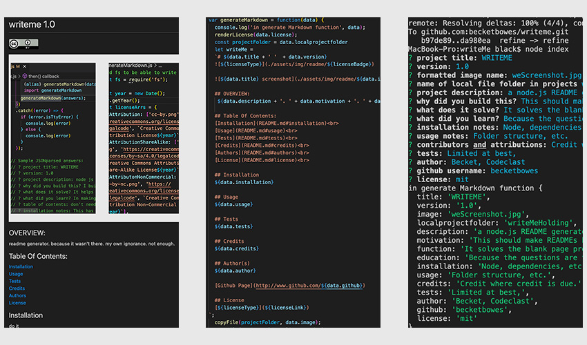

# WRITEME 1.0
  

  

  ## OVERVIEW:
This is node.js README generator. This was built to help prompt and format the information that should be put 
on a README page for any given project. It solves the blank page problem of how to think about communicating a project's utility. It formats questions in a way that makes the information more clear for the reader.
   [Screenshot video link here.](https://watch.screencastify.com/v/K7ul9VY0mFwvWvEe1T2o)

  ## Table Of Contents:
  [Installation](README.md#installation) 
  [Usage](README.md#usage) 
  [Tests](README.md#tests) 
  [Credits](README.md#credits) 
  [Questions](README.md#authors) 
  [License](README.md#license) 

  ## Installation
  This has to be installed with Node as well as fs, which comes with node, and inquirer, an npm package with all of it's dependencies. It is file structure dependant, and it should be installed in your projects folder, next to the other folders that you will be wanting to write READMEs for. Addtionally, there is a file structure with copyright badges and acompanyiing file structure that is important to duplicate from the root of your WRITEME folder: assets/img/readme/{badges}

  ## Usage
  Begin by formatting your screenshots into one 500h x 850 wide JPG. You should upload your image into the assets/img/readme folder before starting the program next to the copyright badges. That file and the badge for the copyright that you choose will be copied into the project folder that you specify when the README is generated. Finally be sure to read over and edit the final version before uploading it to git. This makes and effective first draft of your README, but it needs proofreading.

  ## Tests
  No animals were harmed in the testing of this app.

  ## Credits
  This was written by me, though many thanks to everyone who wrote all of the supporting programs, and specifically the TAs who helped me out with a bug on Saturday! Nothing is done in a vacuum. 

  ## Questions
  [Becket, Codeclast](becketbowes@gmail.com)
  [Github Page](http://www.github.com/becketbowes)

  ## License
  [Creative Commons Attribution Share-Alike License, Sat Feb 12 2022 19:17:26 GMT-0500 (Eastern Standard Time)](https://creativecommons.org/licenses/by-sa/4.0/legalcode)
